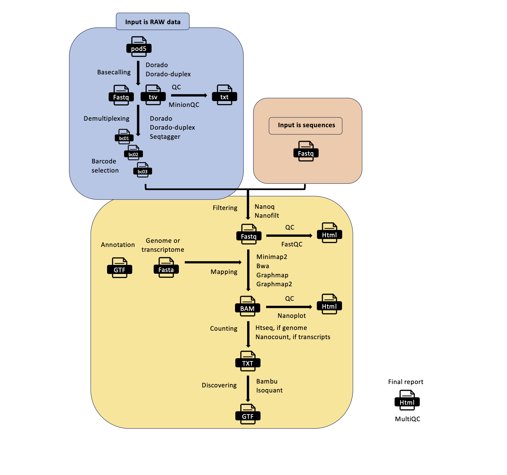

.. _home-page-moprepr:

*******************
MOP_PREPROCESS
*******************

.. autosummary::
   :toctree: generated

This pipeline takes as input the raw reads - single or multi - and it produces several outputs (basecalled pod5, sequences in fastq format, aligned reads in BAM format etc). The pre-processing pipeline can perform base-calling, demultiplexing (optional), filtering, quality control, mapping to a reference (either a genome or a transcriptome), feature counting, discovery of novel transcripts, and it generates a final report with the performance and results of each of the steps performed.

It support the new pod5 format. The basecalling can be performed with dorado or dorado-duplex and the demultiplexing with either dorado or seqtagger. Basecalled fastq and pod5 files can be demultiplexed as well. You can restrict the number of barcodes by indicating a file with barcode list using the **barcodes** parameter.

Input Parameters
======================

The input parameters are stored in yaml files like the one represented here:

.. literalinclude:: ../mop_preprocess/params.yaml
   :language: yaml

You can change them by editing this file or using the command line as explained in the next section.

How to run the pipeline
=============================

Before launching the pipeline, the user can decide which containers to use: either docker or singularity **[-with-docker / -with-singularity]**.

Then, to launch the pipeline, please use the following command by specifying the path of the yaml parameter file:

.. code-block:: console

   nextflow run mop_preprocess.nf -with-singularity -params-file params.yaml > log.txt

You can run the pipeline in the background by adding the nextflow parameter **-bg**:

.. code-block:: console

   nextflow run mop_preprocess.nf -params-file params.yaml -with-singularity -bg > log.txt

You can change the parameters either by changing the yaml config file or by feeding the parameters via command line:

.. code-block:: console

   nextflow run mop_preprocess.nf -with-singularity -params-file params.yaml -bg --output test2 > log.txt

You can specify a different working directory with temporary files:

.. code-block:: console

   nextflow run mop_preprocess.nf -with-singularity -params-file params.yaml -bg -w /path/working_directory > log.txt

You can use different profiles for running the pipeline in different environments. We have one set up for HPC using the SGE scheduler:

.. code-block:: console

   nextflow run mop_preprocess.nf -with-singularity -bg -params-file params.yaml -w /path/working_directory -profile cluster > log.txt

One for HPC using the slurm scheduler

.. code-block:: console

   nextflow run mop_preprocess.nf -with-singularity -bg -params-file params.yaml -w /path/working_directory -profile slurm > log.txt

One for emulating the new M1 processor for Apple:

.. code-block:: console

   nextflow run mop_preprocess.nf -with-singularity -bg -params-file params.yaml -w /path/working_directory -profile m1mac > log.txt

or you can run the pipeline locally:

.. code-block:: console

   nextflow run mop_preprocess.nf -with-singularity -bg -params-file params.yaml -w /path/working_directory -profile local > log.txt

.. note::

   * In case of errors you can troubleshoot by seeing the log file (log.txt) for more details. Furthermore, if more information is needed, you can also go to the intermediate directory indicated in the log and check both the `.command.log` and `.command.err` files.

.. tip::

   Once the error has been solved or if you change a specific parameter, you can resume the execution with the **Netxtlow** parameter **- resume** (only one dash!). If there is an error, the pipeline will resume from the process that had the error and proceed with the rest.  If you change a parameter, only the processes affected by this parameter will be re-run.

.. code-block:: console
   nextflow run mop_preprocess.nf -with-singularity -params-file params.yaml -bg -resume > log_resumed.txt

   To check whether the pipeline has been resumed properly, please check the log file. If previous correctly executed processes are found as   *Cached*, the resume worked!

.. code-block:: console

      ----------------------CHECK TOOLS -----------------------------
   basecalling : dorado
   > demultiplexing will be skipped
   mapping : minimap2
   filtering : nanoq
   counting : nanocount
   > discovery will be skipped
   --------------------------------------------------------------
   Skipping the email

   [15/cc7992] Cached process > checkRef (Checking curlcake_constructs.fasta.gz)
   [e7/fe0c2b] Submitted process > BASECALL:DORADO_BASECALL:downloadModel (A---1)
   [a8/fc6e07] Submitted process > BASECALL:DORADO_BASECALL:baseCallMod (A---1)
   [95/044f06] Submitted process > BASECALL:DORADO_BASECALL:baseCallMod (m6A---2)
   [a1/867fa2] Submitted process > BASECALL:DORADO_BASECALL:bam2ModFastq (A---1)

.. note::
   To resume the execution, temporary files generated previously by the pipeline must be kept. Otherwise, the pipeline will re-start from the beginning.

Command line options
====================

The command line options for each tool used in the pipeline are stored within in the same yaml file with other parameters. The section is called **progPars**. Here is an example:

.. literalinclude:: ../mop_preprocess/params.yaml
   :language: yaml
   :emphasize-lines: 44-65

The second level indicates the processing step as **basecalling** or **demultiplexing** etc, while the third indicates the tool. Finally you have the command specific command line between quotation marks.

.. note::
   You can indicate the models to be used for basecalling with dorado or dorardo-duplex as "sup,m6A_DRACH". The pipeline will try to download before and then to perform the basecalling. In case you want a specific model version you need to indicate the base simplex model as "rna002_70bps_hac@v3,pseU". You can see `here <https://github.com/nanoporetech/dorado?tab=readme-ov-file#dna-models>`_ the list of models and modifications.

.. tip::
   You don't need to specify the whole path for the models of seqtagger, just the name of the model will be enough

Model libraries for specific tools
====================
The following folders are available for the respective tools. Some models are already pre-installed-

* seqtagger_models
   * b04_RNA002
   * b04_RNA004

You also need to add the dedicated parameter within the tool_opts file for the specific tool as:

.. code-block:: yaml
   ...
   basecalling:
      dorado: "sup,m6A_DRACH"
      dorado-duplex: "sup"
   demultiplexing:
      seqtagger: "-k b100"
       dorado: ""
   ...

.. note::
   You need to copy the model in the corresponding folder and indicate just the model name. You don't need the absolute path.

Barcodes
===================

You can select the barcodes you are interested in by writing them down in a text file as in this example. The format is *samplename---barcodeID*

.. literalinclude:: ../mop_preprocess/keep_barcodes.txt

The sample id is given by either the folder containing the fast5 files or the basename of the fastq files. So, if your files are in a folder named **myfiles**, it will be:

.. code-block:: console

   myfiles---bc_1
   myfiles---bc_2
   myfiles---bc_3

.. note::

   The naming convention of the different barcodes is decided by each tool, so **seqtagger** will produce **bc_1**, **bc_2**, etc. while guppy will produce **barcode01**, **barcode02**, etc.

Results
====================

Several folders are created by the pipeline within the output directory specified by the **output** parameter:

* **pod5_files**: Contains the basecalled multifast5 files. Each batch can contain a variable number of sequences.
* **fastq_files**: Contains one or, in case of demultiplexing, more fastq files.
* **QC_files**: Contains each single QC produced by the pipeline.
* **alignment**: Contains the bam file(s).
* **cram_files**: Contains the cram file(s).
* **counts**: Contains read counts per gene / transcript if counting was performed.
* **assigned**: Contains assignment of each read to a given gene / transcript if counting was performed.
* **report**: Contains the final multiqc report.
* **assembly**: It contains assembled transcripts.
